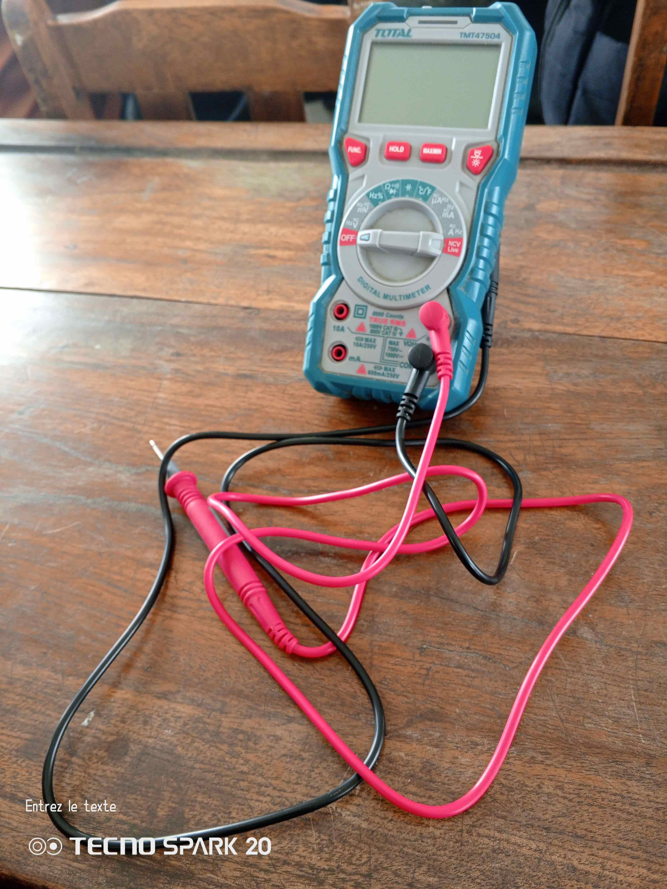
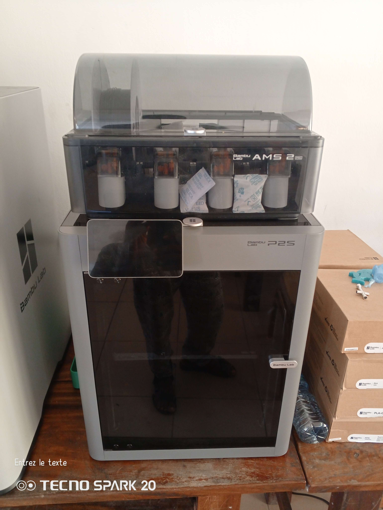
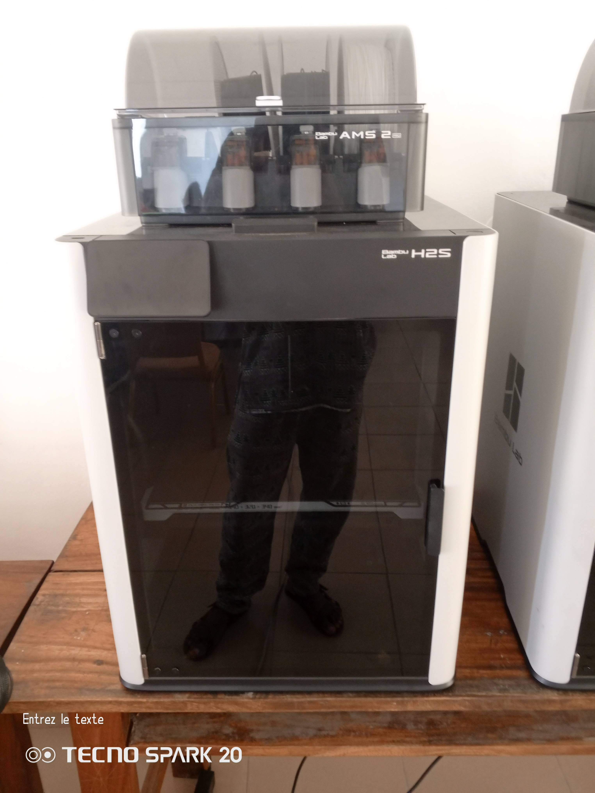

# Journal — mercredi 26 août 2026 (rédigé par : Kodjo KASSA)

## Fait aujourd'hui

* ### Les bases de l'électronique dans les FabLab
1. Etude de grandeurs éléctriques : par le biais de l'analogie hydraulique, decouverte de la tension, du courant, de la résistance e de la Loi d'OHM; du condensateur.
2. Travaux pratiques avec le multimètre.
* * Branchements (bornes COM, VΩmA) et la gestion des calibres.
* * Mésures de tension et de resistance.

* ### Fabrication additive : Des principes généraux à l’impression 3D FDM
1. Étudier le fonctionnement de la fabrication additive et de l'impression 3D FDM
2. Découverte de quelques imprimantes 3D dont Bambu Lab P2S  et Bambu Lab H2S 
3. Analyser les étapes clés de la production 3D, de la modélisation jusqu'au tranchage.
4. le tableau comparatif des technologies (FDM, SLA, SLS, SLM) et la classification des filaments (PLA, PETG, ABS, ASA, TPU).

* ### Fondamentaux de la decoupe laser 
1. Definition et anatomie d'une decoupe laser.
2. Découverte des familles de lasers industriels.
3. Etude des machines F2 Ultra, P3, MétalFab, M1 Ultra et comment choisir sa machine Laser.

* ### Réflexion sur les projets de fin de Formation

## Appris
* Comment calculer la valeure d'une résistance en utilisant ses anneaux colorés :
1. Placer la résistance dans le bon sens (l'anneau doré ou argenté vers la droite)
2. l'ordre des couleurs ( la phrase magique **"Ne Mangez Rien Ou Jeûnez Voilà Bien Votre Grande Bêtise"** )
Noir = 0 | Marron = 1 | Rouge = 2 |Orange = 3 | Vert = 5 | Bleu = 6 |Violet = 7 | Gris= 8 | Blanc = 9 |
3. Appliquer la formule
(chiffre 1)(chiffre 2)(chiffre 3) * (multiplicateur) ± (tolérence %)

* **L'anisotropie** : En FDM, la résistance mécanique d'une pièce est plus faible entre les couches qu'au sein d'une même couche, ce qui rend l'orientation dans le slicer cruciale.
* **Rôle de la rétraction** : Ce paramètre fait reculer le filament lors des déplacements à vide pour éliminer le *stringing* .
* **Critères de choix des filaments** : Le PLA est idéal pour débuter (Prototype simple) mais la piece se dégrade plus vite , le PETG pour les pièces mécaniques courantes (Pièce plus résistante), l'ABS/ASA pour la résistance thermique/UV, et le TPU pour la flexibilité.
* **Résolution des défauts courants** : Le *warping* est causé par un refroidissement inégal et se corrige avec un plateau chaud, une enceinte ou un *brim*.

* Nous avons les laser CO2 (10000 nm) pour les non métaux, FIBRE ( 1064 nm) pour les solides-métaux, DIODE (355 nm) les semi conducteur, UV.

## Raté, puis corrigé
* Pas de diffculté particulière aujourd'hui.

## Décidé
* Ne jamais brancher le multimètre aux bornes d'un composant sans avoir vérifié au moins deux fois le mode sélectionné.
* Toujours isoler une résistance avant d'éffectuer une mesure afin de ne pas fausser les resultats.

## À faire demain
* TP : Journalisation
* Continuer de reviser les syntaxes de Markdown et les codes nécessaires au niveau du terminal de VSCode
* S'entrainer sur Xtools 