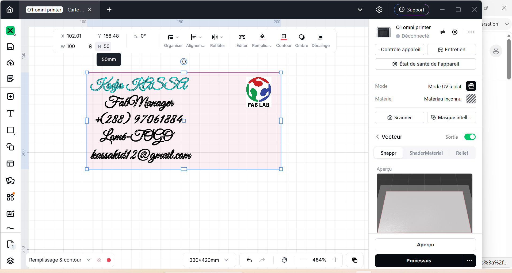
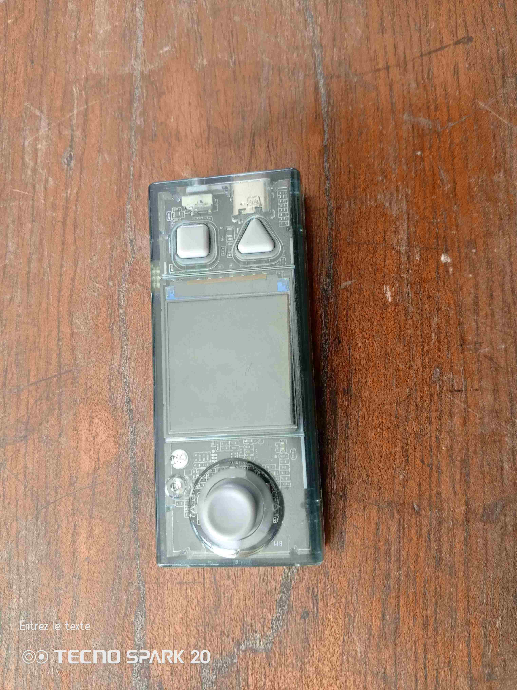
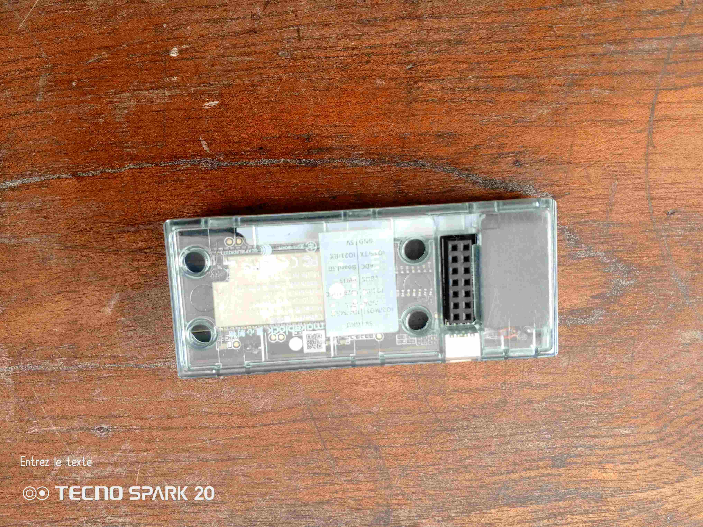
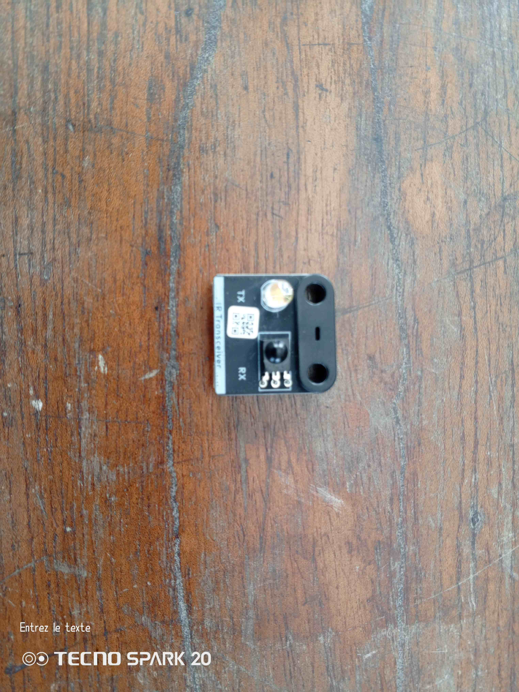
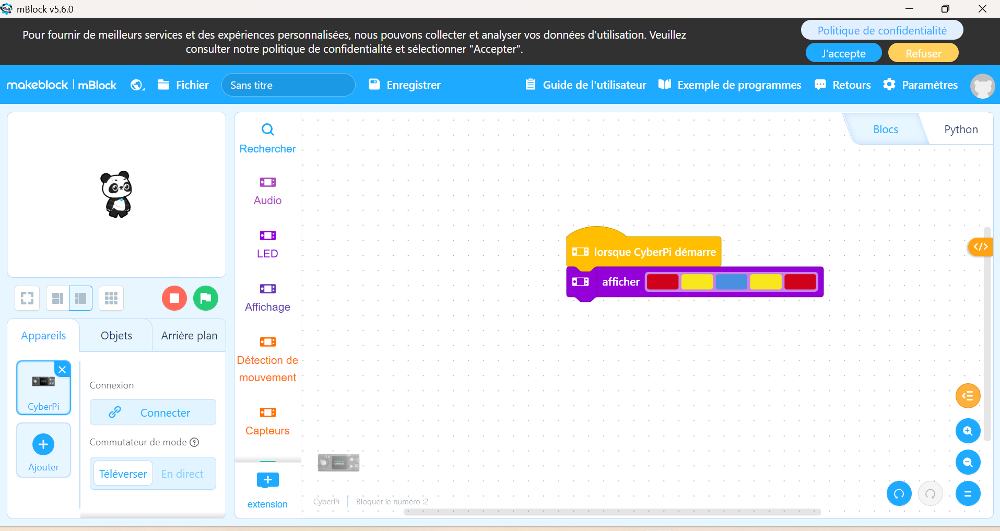
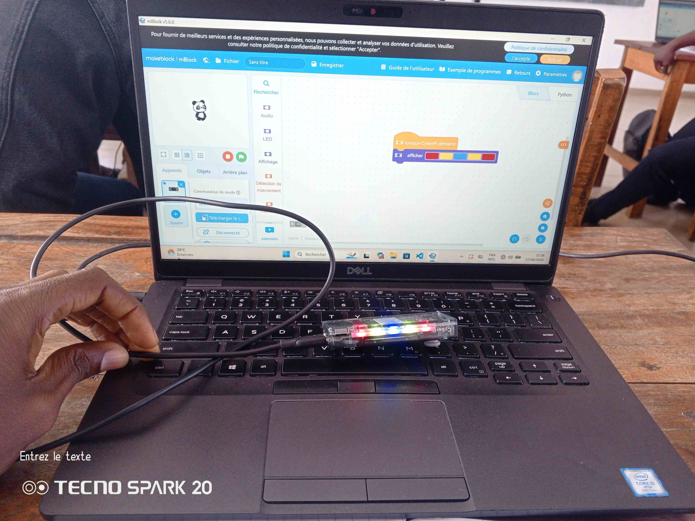
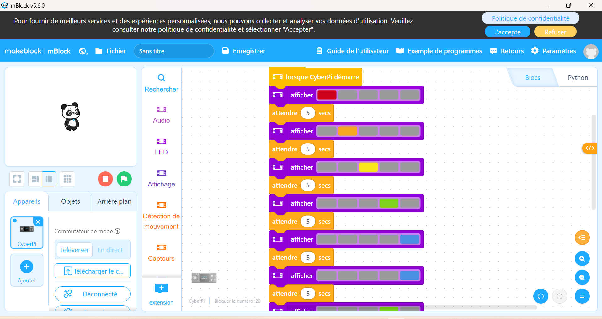
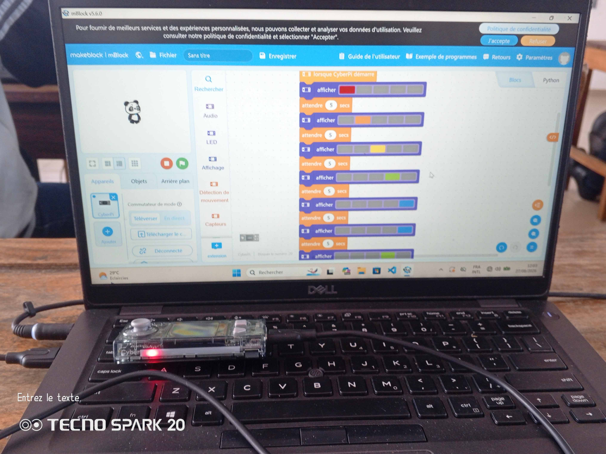
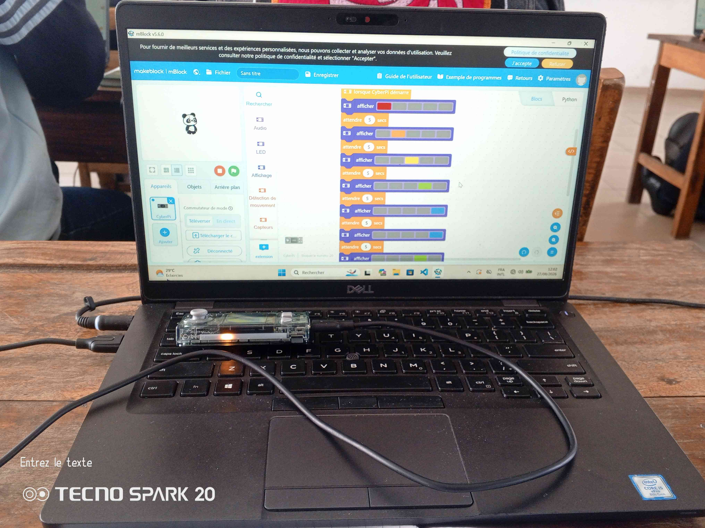
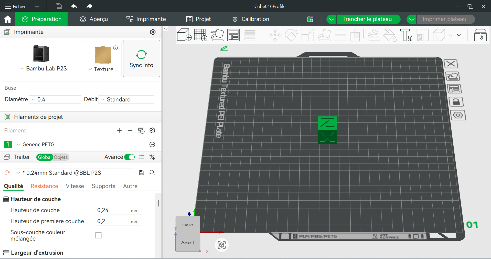

# Journal — jeudi 27 août 2026 (rédigé par : Kodjo KASSA)

## Fait aujourd'hui
 
### Découpe lazer

- Atelier de conception de carte de visite en utilisant Xtools pour dessiner le model. 

### Électronique

- Découverte de CyberPi & l'ecosystème mBuild (Capteurs, actionneurs).
 

- Projets Pratiques .
- - Allumer toutes les LED de la CyberPi.
 

- - Allumer successivement chaque LED en laissant les autres éteintes.

 

### Impession 3D FDM
- Du Model 3D au G-Code : rôle du Slicer
- Projet Pratique d'impression d'un cube 

## Appris

- Utiliser "les controls" pour coder les conditions dans lesquelles les LED s'allument sur la CyberPi.
- Le slicer découpe virtuelement le model 3D en fines couches horizontales et genère le code.

## Raté, puis corrigé

- Avoir eu mal à trouver rapidement le bon bloc de contrôle pour réaliser "Allumer successivement chaque LED en laissant les autres éteintes."

## Décidé

- Éssayer de traduire l'action en algorithme (Allumer X → Attendre → Éteindre X) avant de chercher le bloc.

## À faire demain

- Refaire les mêmes exercices et éssayer d'autres.