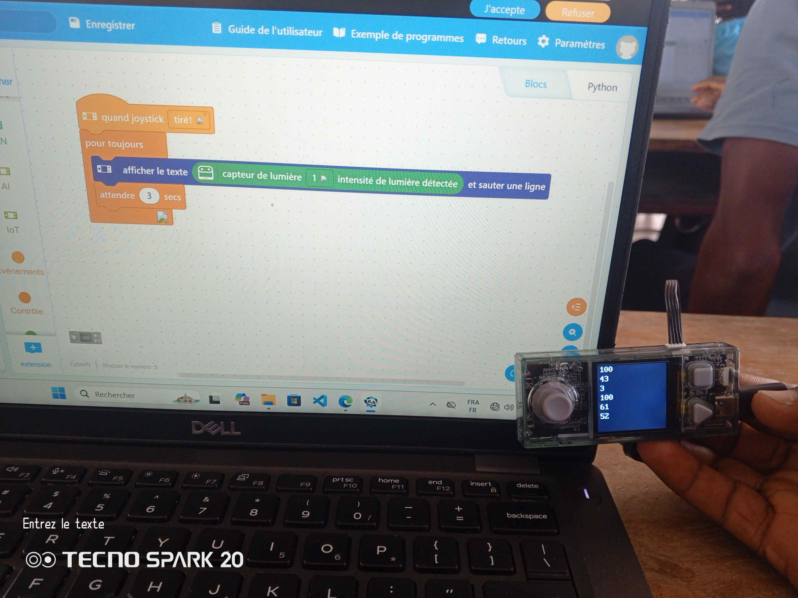
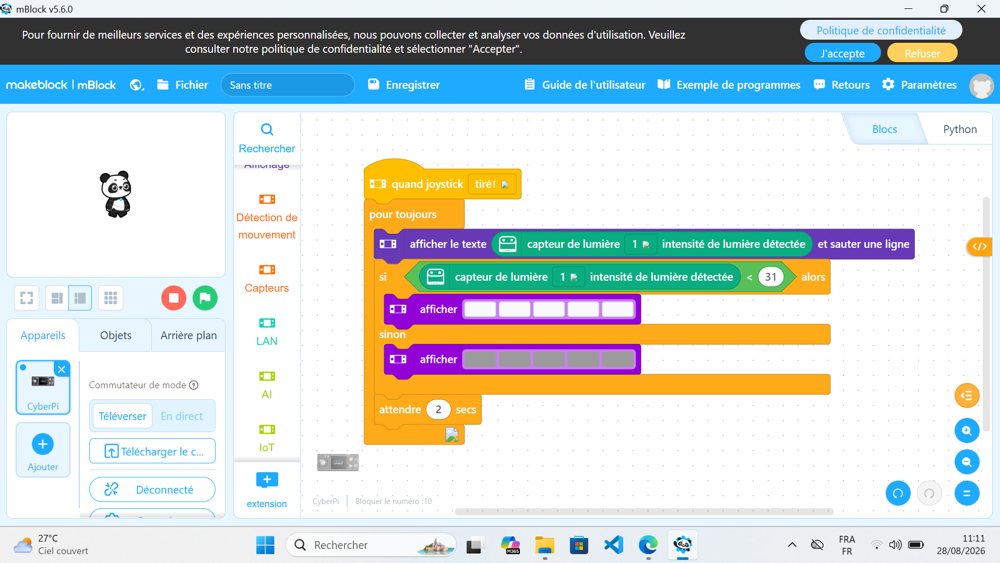
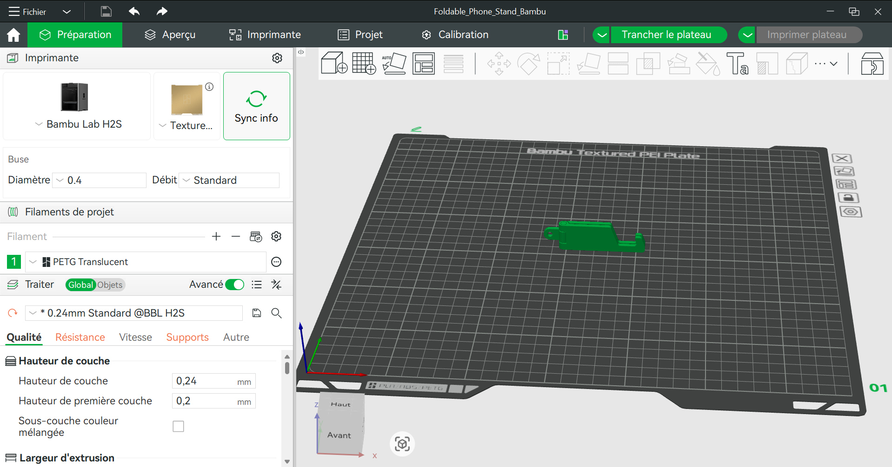

# Journal — vendredi 28 août 2026 (rédigé par : Kodjo KASSA)

## Fait aujourd'hui

### Électronique

- TP d'électronique pour mésurer la lumière ambiante avec un capteur de lumière et afficher la luinausité sur une Cyberpi  .
- TP d'électronique pour éteindre la LED si la lumunausité ambiante est superieure à 31 et allumer si elle est inferieure à 31  .

### Impression 3D FDM

- TP d'impression 3D :
1. La préparation du modèle 
2. La configuration de la machine
3. Le suivi de la fabrication

### Découpe laser : TP en atelier libre

### Découverte du Design Thinking et de la méthode spirale (2 heures)

## Appris

- Mieux utiliser les blocs de controls et de capteurs dans le logicel Mblock.
- Transformer un objet 3D en G-code et orienter la pièce pour avoir une meilleure solidité et reduire le temps d'impression.

* Design Thinking
1. Une méthode de conception
2. centrée sur l'usager
3. Ouvrir puis trancher
4. Une origine documentée

les 5 Etapes
Empathie, Idée, Prototyper, Tester,  Observer.
Le processus n'est pas linéaire, mais itéractive. <On peut repartir du 4 au 2 si on rencontre un problème >

* Méthode spirale

## Raté, puis corrigé

- Aucune erreur rencontrée.

## Décidé

- continuer de m'exercer avec les conditions dans Mblock, d'apprendre à mieux orienter les pieces, de comprendre les paramètres des differentes imprimentes et des filaments.

## À faire demain

- continuer de m'exercer avec les conditions dans Mblock. Apprendre à mieux orienter les pièces, de comprendre les paramètres des differentes imprimentes et des filaments.