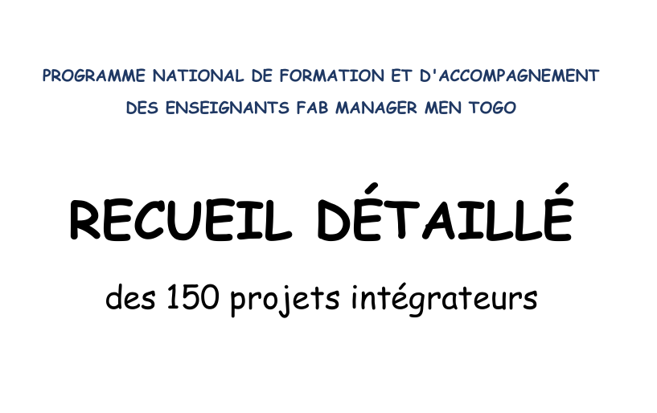

# Journal — samedi 29 août 2026 (rédigé par : Kodjo KASSA)

## Fait aujourd'hui

**Projet de groupe**

- Analyse approfondie de la liste des 150 projets intégrateurs nationaux du programme MEN Togo pour identifier les thématiques les plus porteuses.
- Entretiens de group avec les formateurs afin d'évaluer la faisabilité technique et la pertinence pédagogique des choix de projet.
- Validation du choix de projet, qui portera sur la conception et la fabrication d'un Robot QCM

# Appris

- Compréhension des critères d'évaluation d'un projet intégrateur appliqué à l'éducation.

# Raté, puis corrigé

- Dispersion et hésitation prolongée face à la diversité des 150 propositions du recueil, ce qui a failli retarder la prise de décision.

## Décidé

- Arrêt définitif sur le Robot QCM comme projet de fin de formation.
- Engagement à concevoir un prototype fonctionnel, réplicable en milieu scolaire avec les outils disponibles au FabLab.

## À faire demain

- Rédiger la fiche technique descriptive du Robot QCM.
- Établir le planning prévisionnel des premières étapes de modélisation et de prototypage.