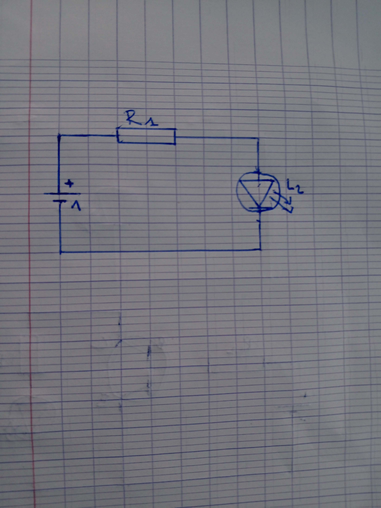
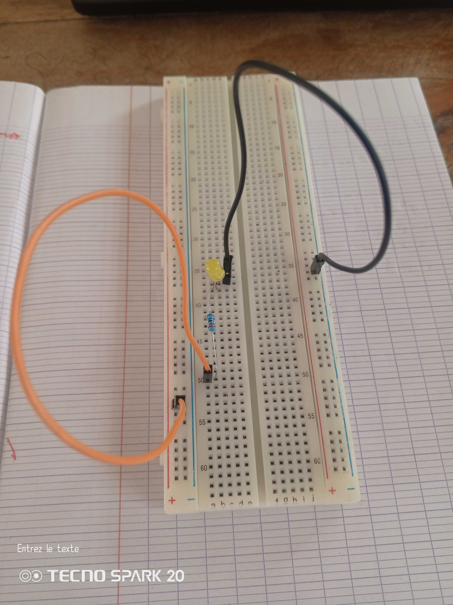
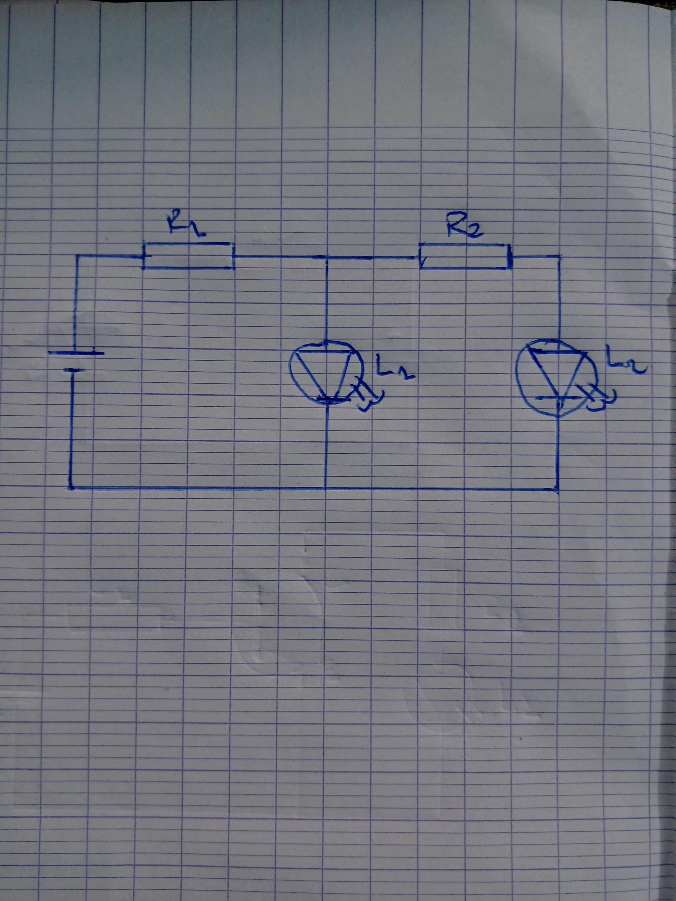
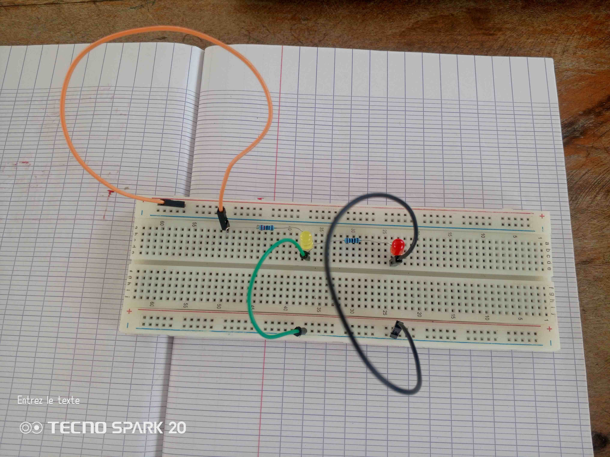
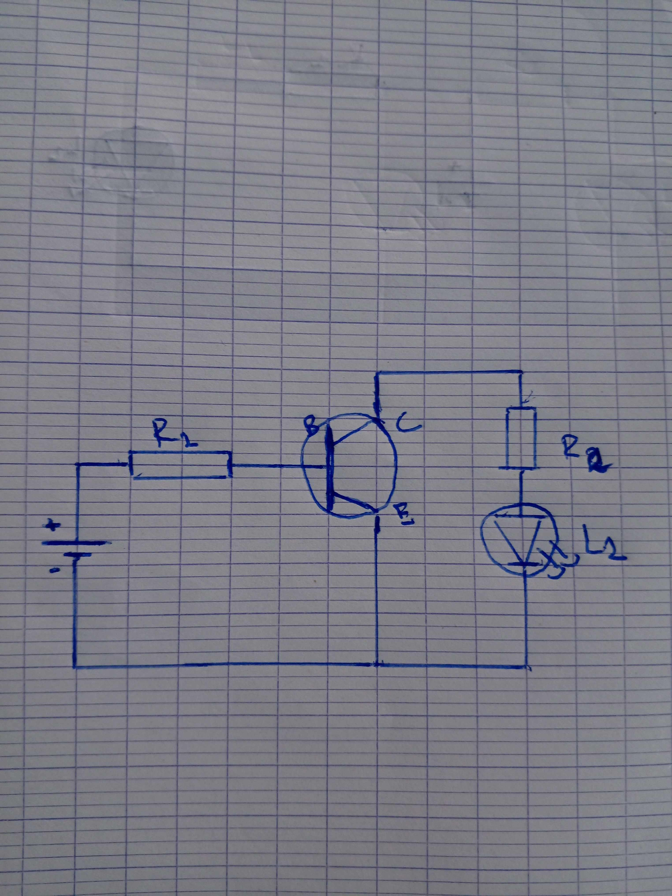
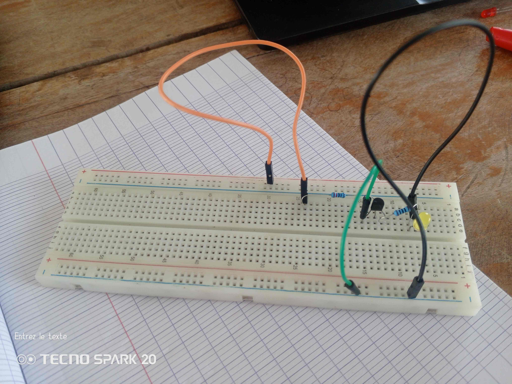
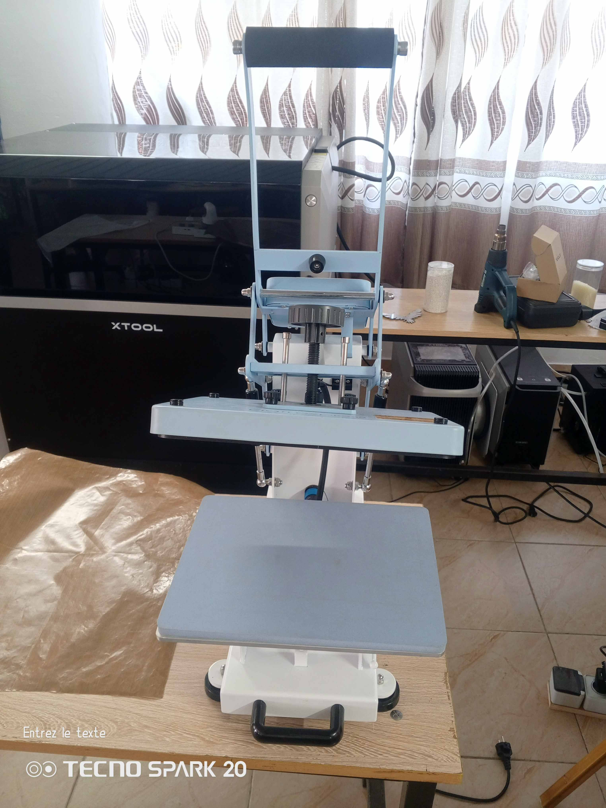

# Journal — mardi 01 septembre 2026 (rédigé par : Kodjo KASSA)

## Fait aujourd'hui
### Électronique
* Découverte du Breadbord Sk10 (encore appeler plaque d'essai sans soudure)  et de son anatomie.  
* Étude du fonctionement du Breadbord Sk10 à travers des TP.
* Étude du fonctionement du Breasbord Sk10 à travers des TP.  &rarr;  
  &rarr; 
  &rarr; 

### Impression DTF

* Découverte de l'impression DTF.

### CAO Fusion 360
* Projet de conceptions avec Fuion 360.

## Appris

* **Le concept :** Le SK10 est une plaque de prototypage à 840 points. Il sert à créer des circuits temporaires rapidement, en clipsant les composants sans aucune soudure.
* **L'anatomie interne :** Sous le plastique, des pinces métalliques relient les trous entre eux selon deux logiques : - Les rails d'alimentation (Bords hauts/bas) : Connectés horizontalement. Ils distribuent le courant (+ et -) sur toute la longueur du circuit. - La zone de composants (Centre) : Connectée verticalement par colonnes de 5 trous (A à E, et F à J). Chaque colonne forme un point électrique unique.
* **Une rainure centrale** sépare la plaque en deux. Elle isole le haut du bas, ce qui est indispensable pour eviter les court-circuit.
* **L'imprimante DTF** ne dépose jamais directement sur le vêtement. Elle imprime d'abord sur un film; le transfert final se fait uniquement avec la presse à chaud .  
Ce qu'il faut retenir de l'impression DTF **Concevoir** &rarr; **Imprimer** &rarr; **Poudrer** &rarr; **Cuire** &rarr; **Presser** &rarr; **Retirer**

## Raté, puis corrigé

* Pas de difficultés particulières aujourd'hui, les instructions ont été bien suivit.

## Décidé

* Pour lier deux composants sur le SK10, ils doivent partager la même colonne. Pour éviter de griller un composant, ses deux pattes ne doivent jamais être dans la même colonne.

## À faire demain

* Réviser en validant un nouveau circuit sur le SK10.
* Maîtriser les bases du logiciel Fusion 360
* Comprendre la préparation pré-impression.
