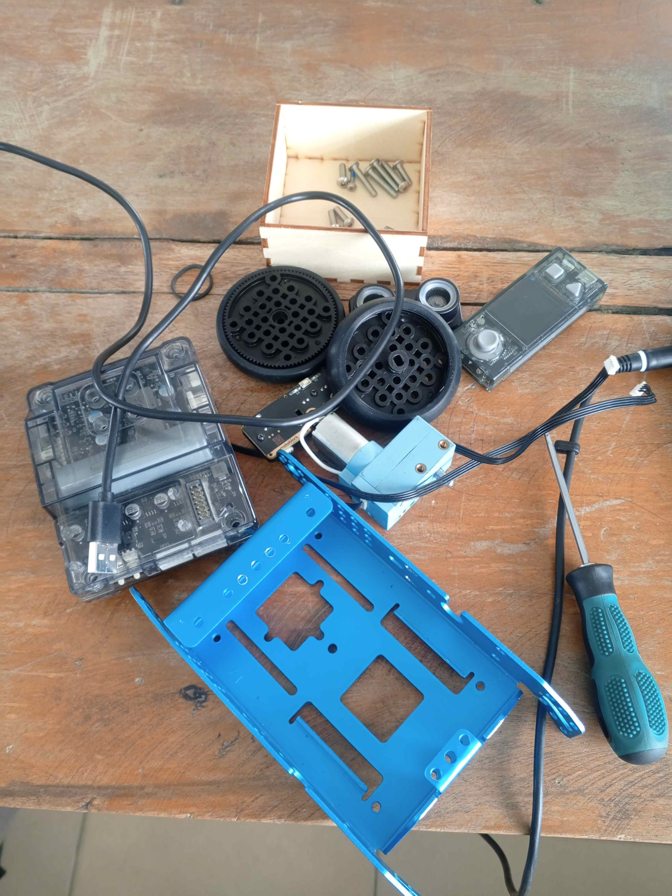
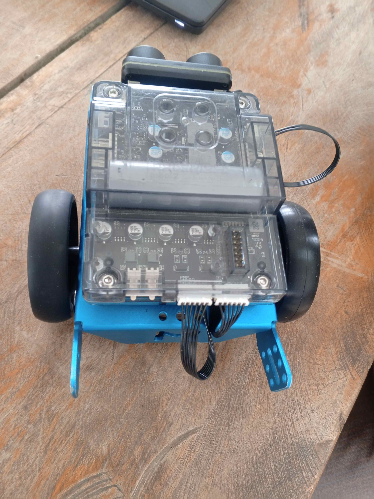
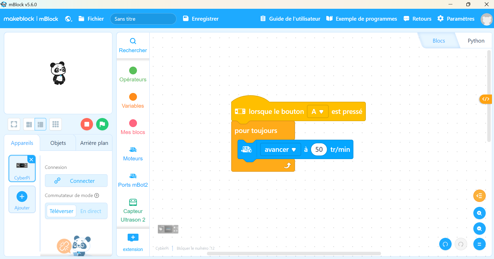
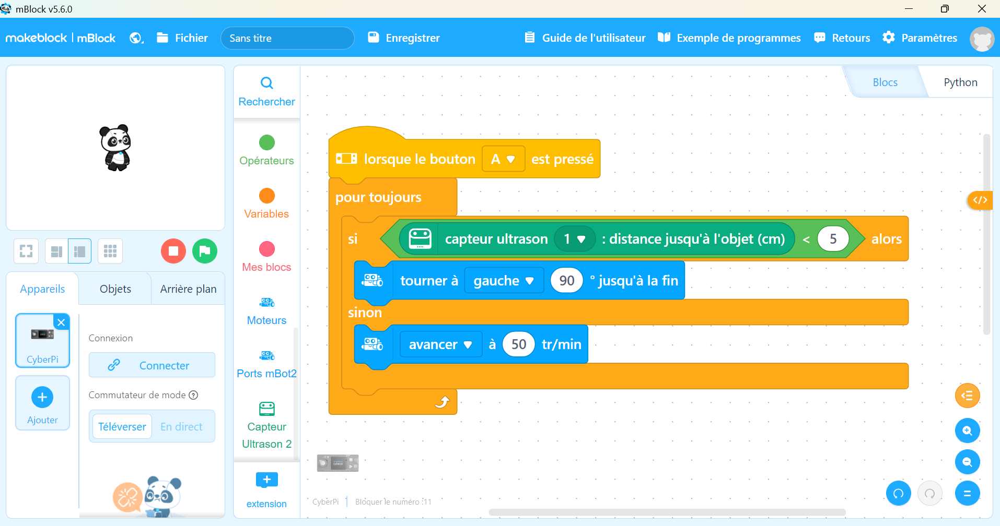
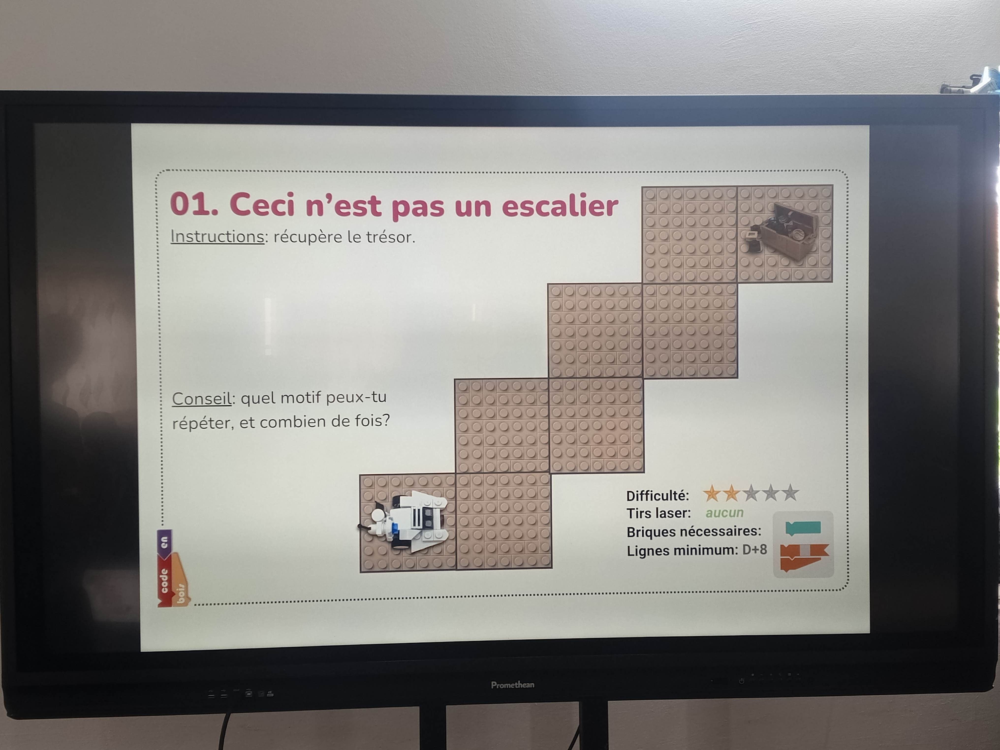
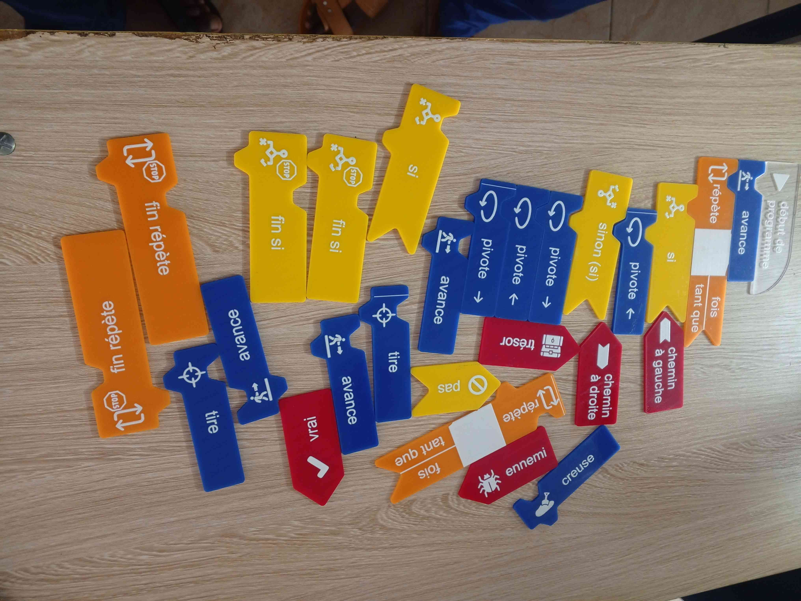

# Journal — mercredi 02 septembre 2026 (rédigé par : Kodjo KASSA)

## Fait aujourd'hui
### Electronique

* Assemblage complet du robot mBot2 à partir des pièces détachées.  
|||
* Écriture d'un programme dans mBlock pour faire avancer le mBot2 si une touche est appuyer sur la CyberPi. 

* Écriture d'un programme dans mBlock pour faire avancer le mBot2 si une touche est appuyer sur la CyberPi et le fait changer de direction si il y a un obstacle sur sa trajectoire.  

### Algorithmique débranchée

* Définition d'un algorithme.
* Histoire de l'algorithme
* Algorithmique débranchée
* un petit exercice qui demande de recupérer un trésor. 
 Qu'il faut resoudre avec des blocks d'instructions débranchées.  

### Projet 

## Appris

* Logique de programmation : Utilisation des blocs de code (ou lignes de code) pour créer des structures logiques.

## Raté, puis corrigé

* Le robot reculait alors que l'instruction lui demandait d'avancer, ce qui etait dû au fait que les fiches de connexion de ses deux moteurs etaient permuter. Ce qui a été resolu en changeant l'instruction "avancer" en "reculer" dans un premier temps, puis dans un second temps en interchangeant les fiches entre les deux moteurs. 

## Décidé

* 

## À faire demain

* Ajuster les variables dans mBlock (vitesse du robot, distance de détection du capteur) lors de la prochaine séance pour rendre les deux programmes plus fluides et précis.