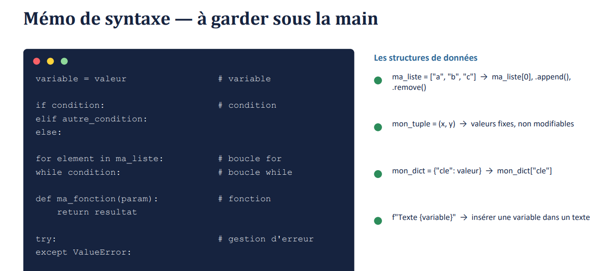

# Journal — vendredi 04 septembre 2026 (rédigé par : Kodjo KASSA)

## Fait aujourd'hui
### Langage Python

* Scripts décisionnels.
* Exercice 2 (Contrôle d'accès) : Écriture d'un script testant le niveau de formation de l'utilisateur (débutant/intermédiaire/expert) et la disponibilité d'une machine.
* Exercice 3 (Suivi de production) : Simulation d'un décompte de stock de départ avec détection des multiples de 5 pour le contrôle qualité et arrêt d'urgence à la pièce n°7.
* Exercice 4 (Inventaire du fablab) : Création et mise à jour d'un dictionnaire de matériaux, avec affichage complet de la liste des clés et des valeurs via une boucle.

### PCB (circuit imprimé)
* Découverte du PCB .
* Anatomie d'un PCB .
* Les pricncipales méthodes de fabrication .
* Xtools F2 ultra pour graver. 

### Fusion 360
* Exercice

## Appris

* Resumer des syntaxes. 
* Opérateurs & Conditions : Manipulation des opérateurs arithmétiques, de comparaison et logiques (and, or, not) pour créer des structures conditionnelles avec if / elif / else.
* Boucles : Utilisation de for i in range() pour répéter une action un nombre de fois précis, parcours de séquences, et utilisation de while avec les instructions break et continue.
* Structures de données : Différence entre les listes modifiables (.append(), .remove(), slicing), les tuples fixes, et les dictionnaires pour l'accès direct aux données par clé.
* Fonctions : Déclaration avec def, passage de paramètres obligatoires ou optionnels (valeurs par défaut), renvoi de résultat avec return et portée locale des variables.
* Fichiers, Erreurs & Modules : Ouverture sécurisée avec with open(), capture d'exceptions avec try / except ValueError, et utilisation de utiles natifs (time, random, math, csv, datetime, os).

* Un PCB (ou circuit imprimé) est un support rigide ou flexible qui permet de relier électriquement et de maintenir des composants électroniques entre eux.
* Les principales méthodes de fabrications du PCB : Perchlorure de fer, Papier + fer à repasser, Fabrication numérique.

## Raté, puis corrigé

* Pas de difficultés particulières aujourd'hui.

## Décidé

* Utiliser le gestionnaire de paquets de Thonny pour installer pip et découvrir le pilotage matériel (gpiozero, pyserial).
* Mettre en pratique toutes les notions de la formation sur un cas concret en autonomie.

## À faire demain

* Utiliser le gestionnaire de paquets de Thonny pour installer pip et découvrir le pilotage matériel (gpiozero, pyserial).
* Mettre en pratique toutes les notions de la formation sur un cas concret en autonomie.