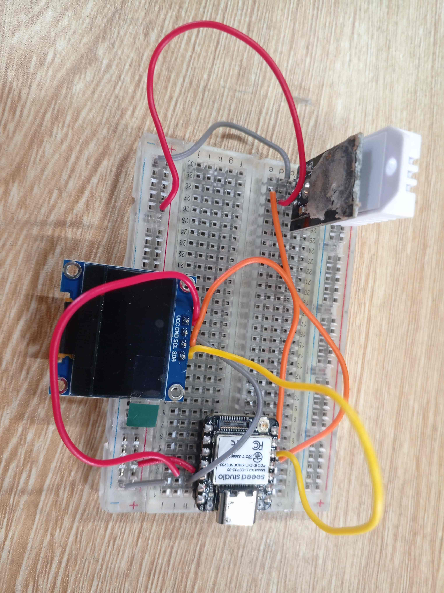

# Journal — samedi 05 septembre 2026 (rédigé par : Kodjo KASSA)

## Fait aujourd'hui

* Configuration de l'environnement : connexion de la carte XIAO ESP32S3 via le câble USB-C.
* Flashage et préparation : Installation réussie du firmware MicroPython adapté à la puce ESP32-S3 et configuration de l'interpréteur dans Thonny.
* Câblage du prototype : Montage sur breadboard du capteur DHT22 (sur la broche D3/GPIO4) et de l'écran OLED SSD1306 en utilisant les broches I2C par défaut (D4/SDA et D5/SCL). 
* Installation du paquet externe micropython-ssd1306 via le gestionnaire de paquets de Thonny pour piloter l'écran.
* Écriture, enregistrement (sous le nom main.py) et exécution du script de test pour mesurer et afficher la température et l'humidité en continu toutes les 2 secondes. 

## Appris

* La XIAO ESP32S3 est une carte officielle puissante (double-cœur, 240 MHz) qui utilise une logique de 3,3 V; il ne faut jamais alimenter les modules en 5 V sous peine de l'endommager.
* Les broches D4 et D5 sont attribuées par défaut au protocole I2C. Il faut impérativement éviter d'utiliser les broches D2, D6 et D7 pour des connexions libres car elles jouent un rôle critique lors du démarrage (boot) de la carte.
* Le pilote du capteur DHT22 est directement intégré au firmware MicroPython (import dht), tandis que celui de l'écran OLED nécessite une installation manuelle dans le dossier /lib.

## Raté, puis corrigé

* Aucune erreur rencontrée.

## Décidé

* Adopter définitivement le réflexe de vérifier le pinout (schéma des broches) du constructeur avant tout câblage pour ne pas griller la carte (limite stricte à 3,3 V).

## À faire demain

*  Reprendre le script main.py ligne par ligne et ajouter des commentaires détaillés pour m'assurer de comprendre l'initialisation de l'I2C et la boucle de lecture.