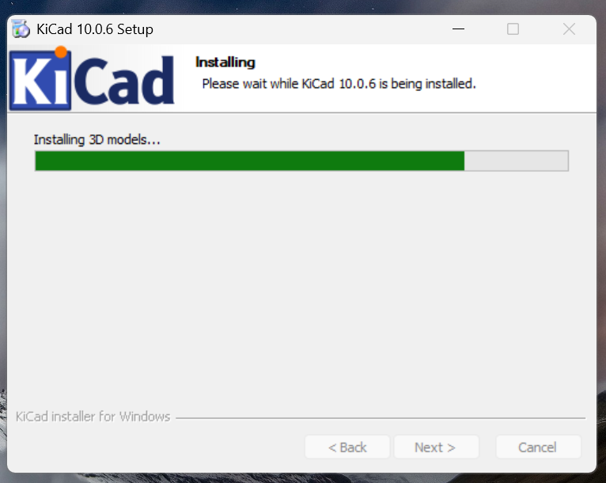
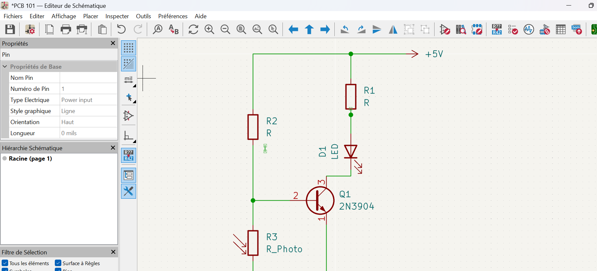
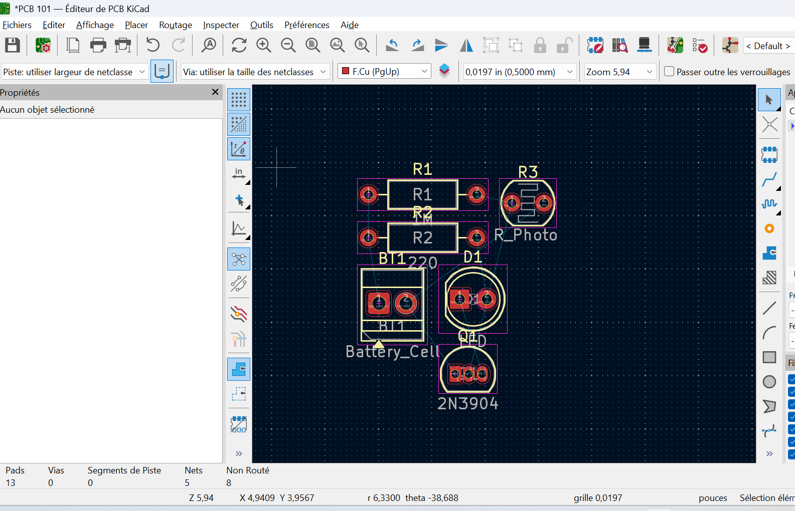
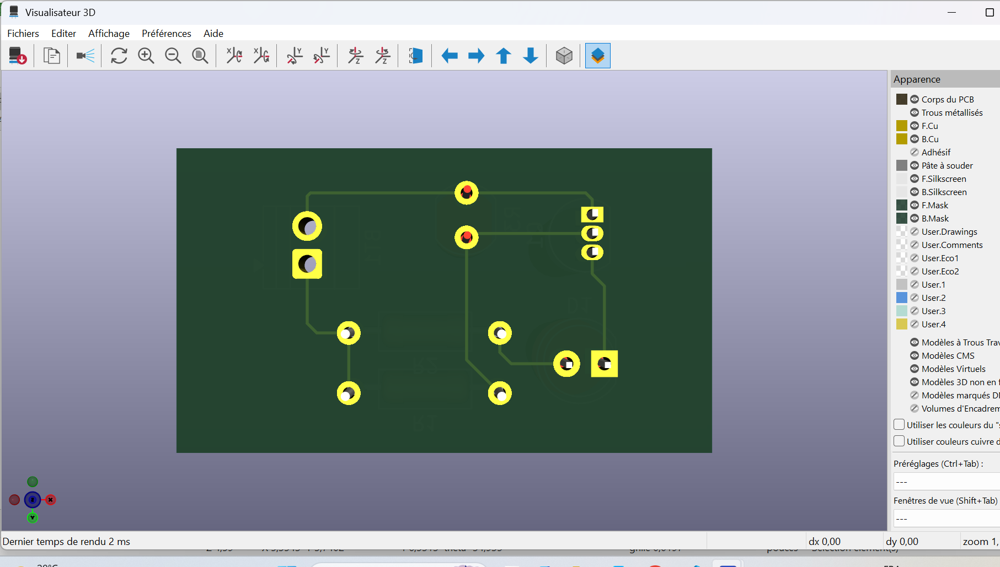
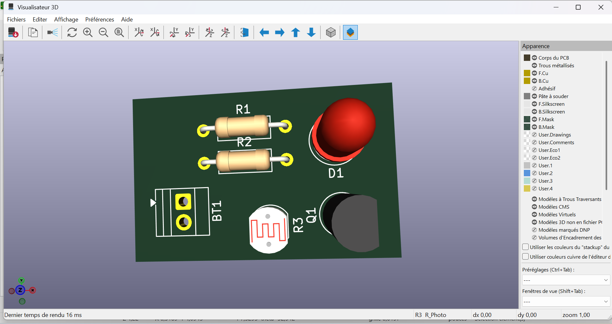
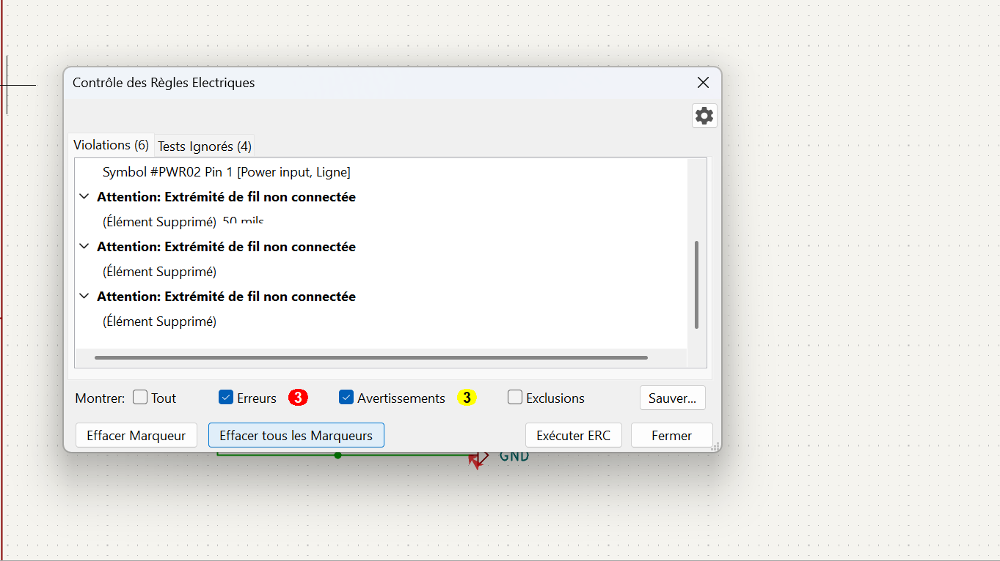

# Journal du lundi 07 septembre 2026 (rédigé par : Kodjo KASSA)

## Fait aujourd'hui

* Installation complète de KiCad (version 10.0.6) . 
* schéma et routage  
* Génération des vues 3D de la carte.

## Appris

* Association des empreintes.
* Utilisation du visualisateur pour inspecter les pistes de cuivre.
* Découverte de l'utilité du bouton Exécuter ERC pour valider la logique du schéma avant de fabriquer la carte.

## Raté, puis corrigé

* Erreurs d'interconnexion (ERC) : Le contrôle électrique a détecté 3 erreurs et 3 avertissements majeurs (notamment une broche d'alimentation #PWR02 Pin 1 non connectée et des extrémités de fils laissées dans le vide).

* Correction : Nettoyage du schéma électrique en supprimant les morceaux de fils fantômes et en raccordant correctement les broches d'alimentation manquantes.

## Décidé

* Option pour des composants traditionnels traversants (THT).

## À faire demain

* Vérifier les erreurs sur la carte : Lancer l'outil de contrôle pour trouver et corriger les pistes mal tracées ou trop proches.