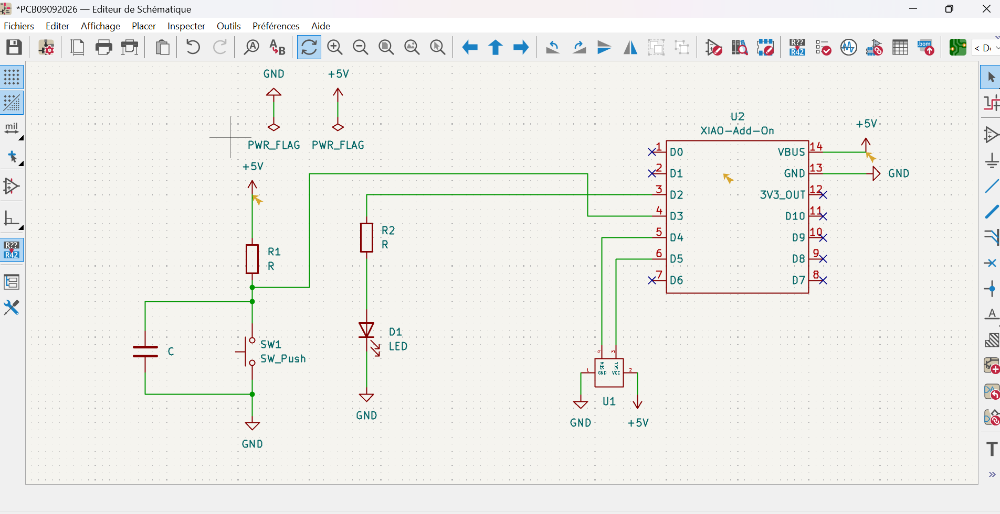
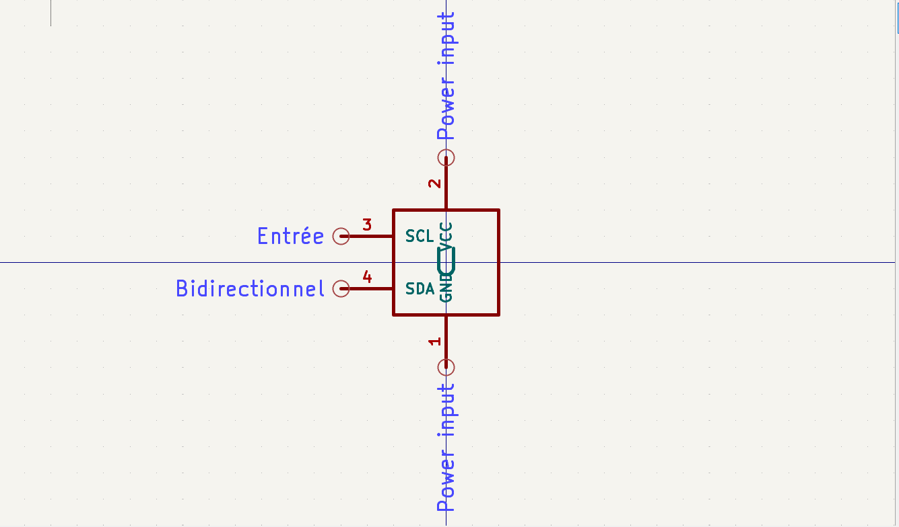
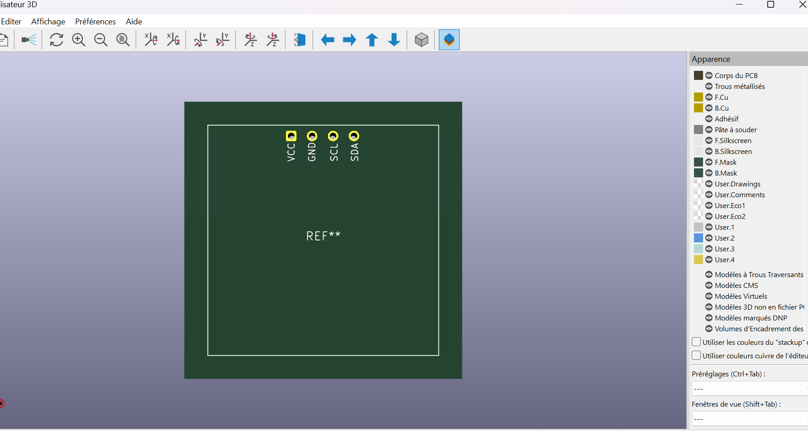
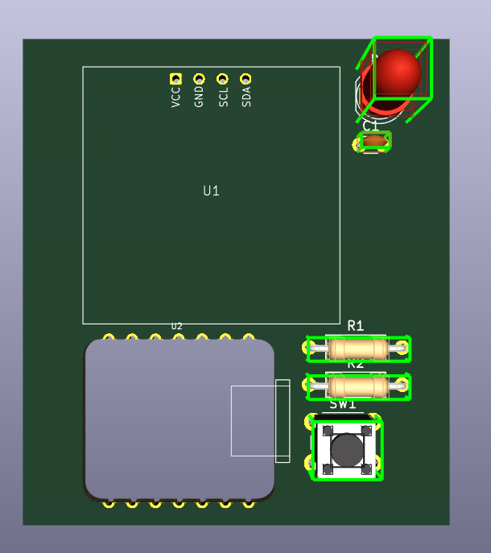

# Journal — mercredi 09 septembre 2026 (rédigé par : Kodjo KASSA)

## Fait aujourd'hui

- Shema électronique : Réaliser sur le tableau et reproduit sous kicad. 
- Librairies kicad : Import des libraires de symboles et empreintes de la XIAO ESP32S3.
- Créaiont composant : Éditions et création d'un symbole + empreinte personnalisée pour l'OLED I2C.   

- MicroPython : Début du cours officiel. Rqppel : on avait déjà fait un projet en utilisant MicriPython avant.

## Appris

- Import et gestion de librairies externes dans kicad.
- Création d'un Symbol + empreinte de A à Z. 

## Raté, puis corrigé

- Conflit de pin. PinD4 utilisé à la fois pour le bouton et pour SDA de du OLED.  
Corriger en deplçant le bouton sur PinD3 pour libérer D4 et D5 pour l'OLED.
- Essai de routage PCB avec des pistes qui se croisent.

## Décidé

- MycroPython pour coder la logique des projets.
- Repositionner les composants sur la carte avant de relier les pistes.

## À faire demain

- Repositionner les composants sur la carte avant de relier les pistes proprement.