# Journal — samedi 12 septembre 2026 (rédigé par : Kodjo KASSA)

## Fait aujourd'hui
**Projet de groupe**

Modélisation 3D du Robot QCM
- Modélisation 3D sur FUSION 360 du corps en forme de pyramide intégrant les découpes pour l'écran principal, les boutons d'interaction et le commutateur.
- Modélisation de la tête du robot en deux parties (coque avant et couvercle arrière clipsable/vissable) avec des ouvertures rectangulaires pour les yeux (écrans/LED) et une grille circulaire pour le haut-parleur.
- Dessin technique de la pièce d'articulation inférieure.
 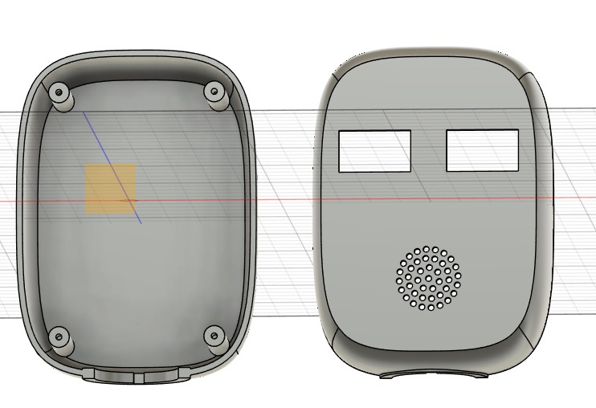 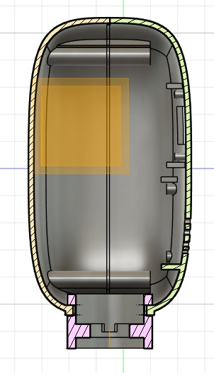 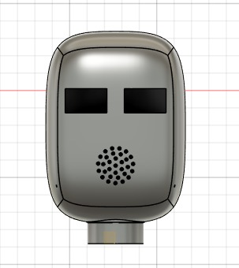 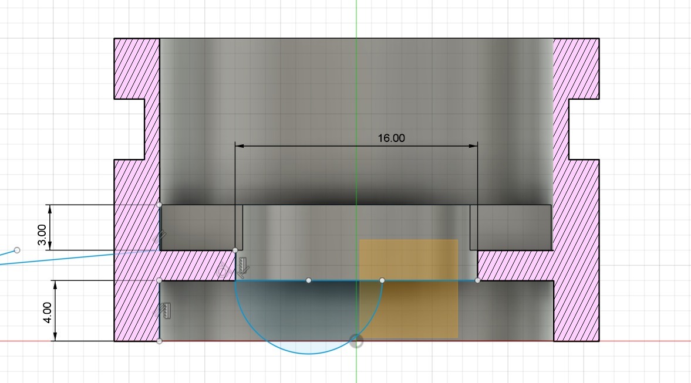 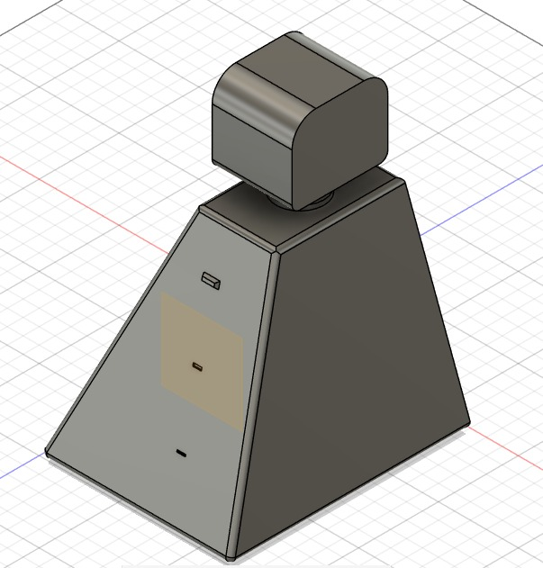  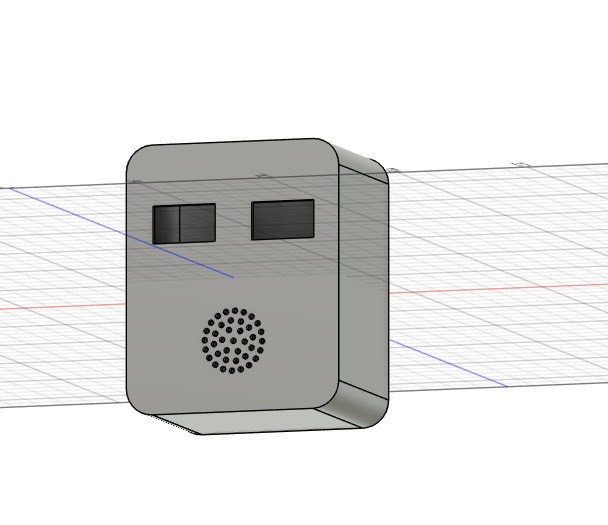  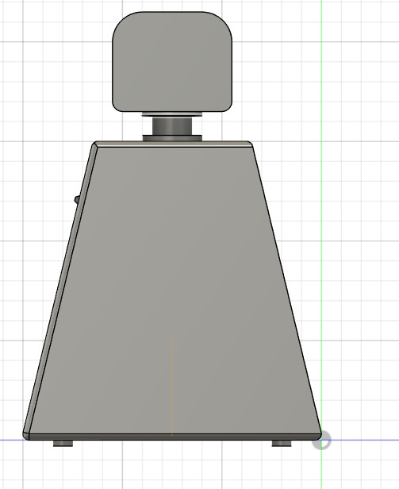  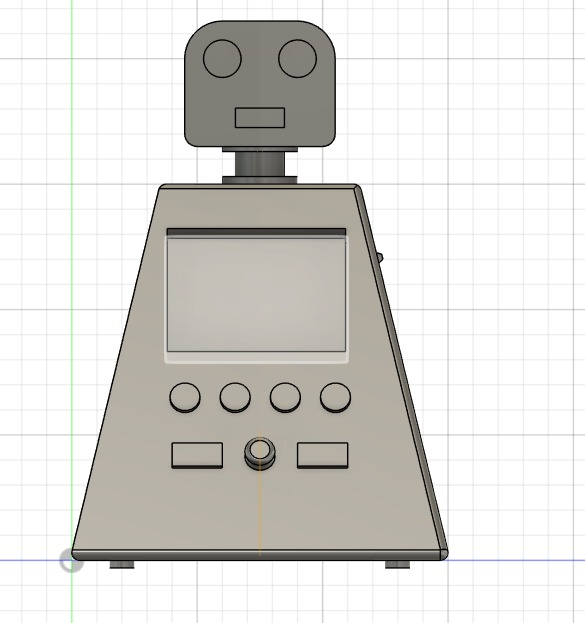   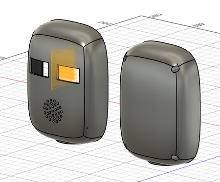 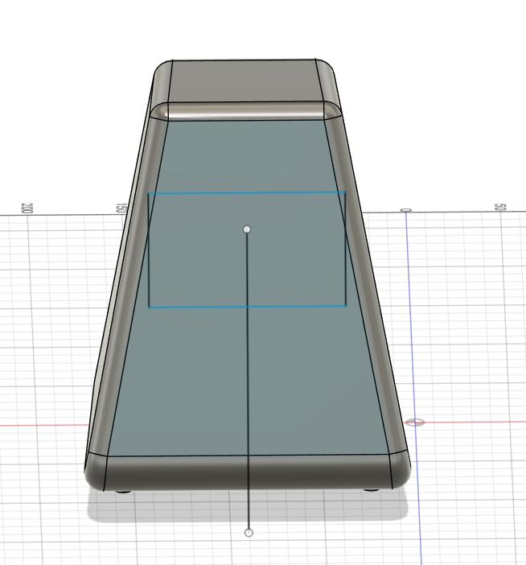    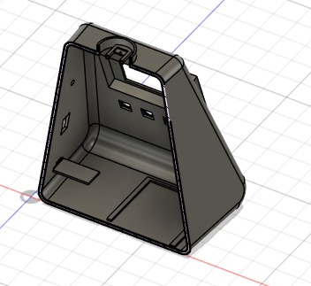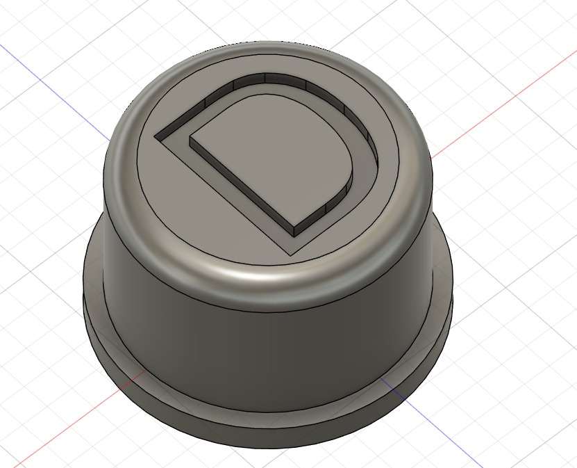 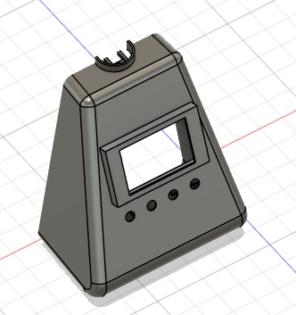 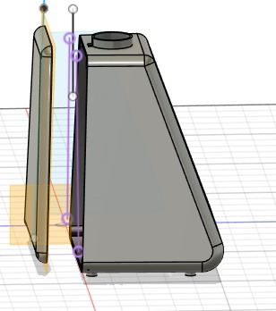   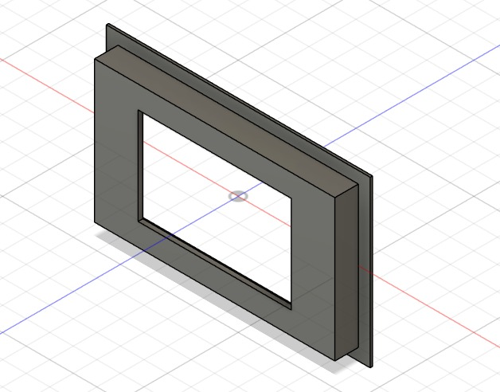 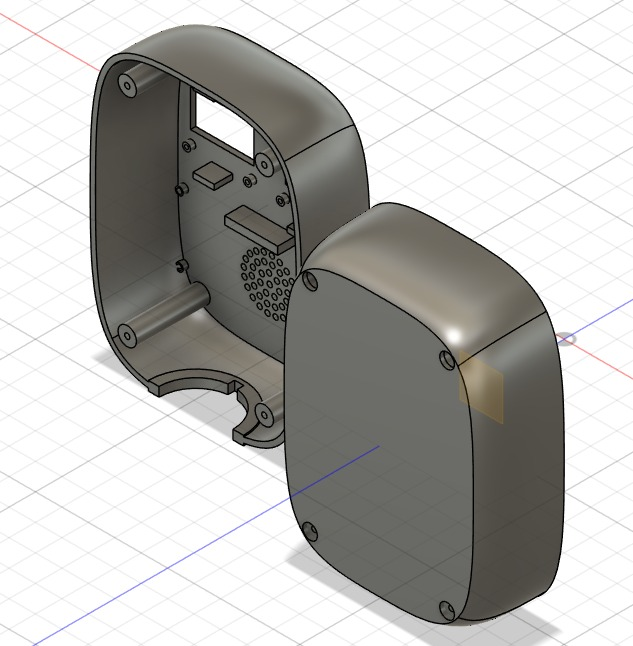  

# Appris

-  Utilisation des vues en coupe pour analyser l'ajustement exact des pièces.

# Raté, puis corrigé

- L'ajustement mécanique a été corrigé en ajoutant des bossages internes pour aligner parfaitement les deux parties de la coque.

## Décidé

- Utilisation d'un système d'assemblage par vis via les 4 inserts d'angle pour faciliter la maintenance et l'accès aux composants internes.

## À faire demain

- Ajuster le jeu fonctionnel sur les pièces imbriquées en vue de l'impression 3D.
- Exporter les fichiers au format STL pour lancer le prototypage  des pièces de structure.