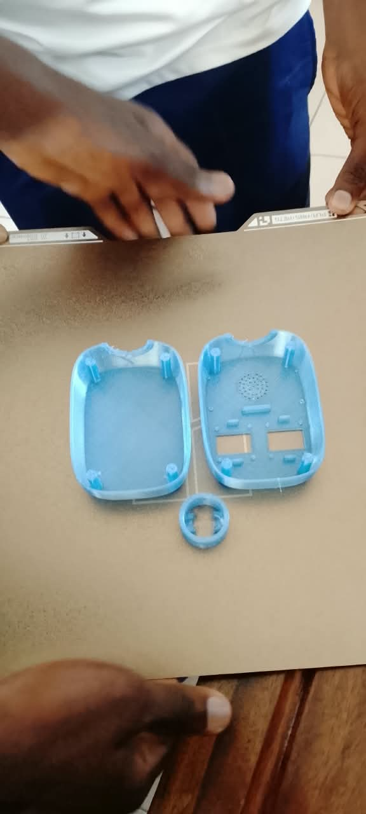
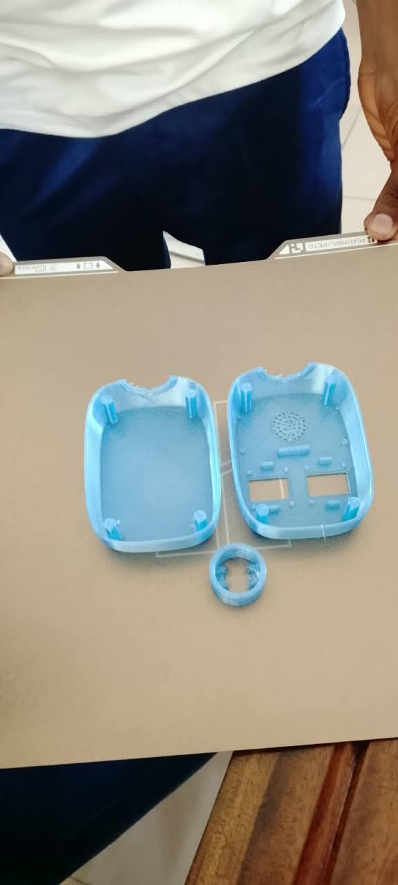
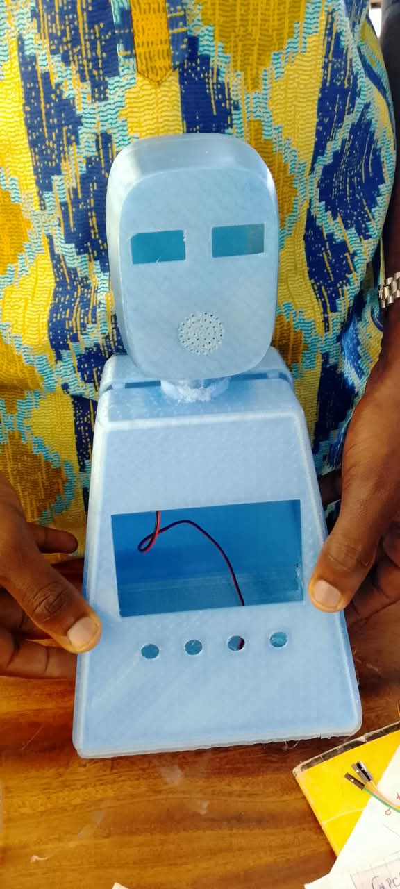
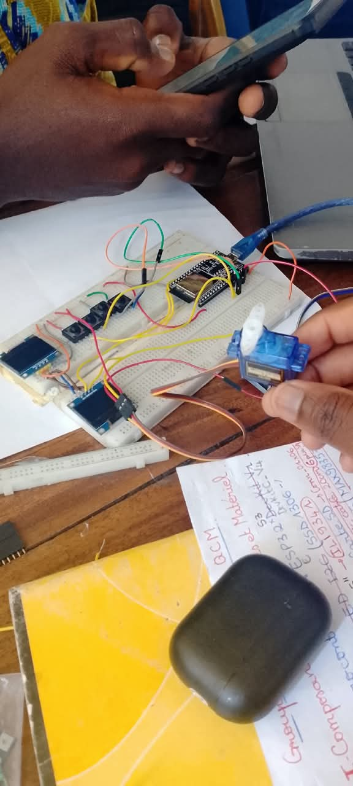
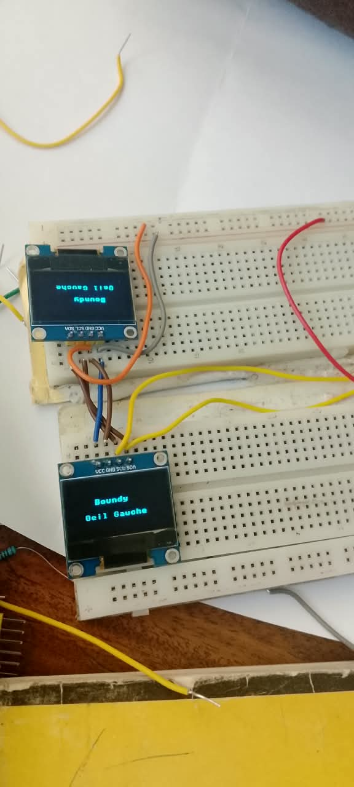

# Journal — mardi 15 septembre 2026 (rédigé par : Kodjo KASSA)

## Fait aujourd'hui

**Projet de groupe**

- Impression 3D finale du corps et de la tête. Corps avec fenêtre pour écran + 4 trous pour boutons A/B/C/D. Tête avec 2 fenêtres rectangulaires pour les yeux OLED et grille pour haut-parleur.  
 
- Montage sur breadboard comprenant la carte ESP32 devkit c v4, un servomoteur, des boutons poussoirs et deux écrans OLED (SSD1306). 
- Programmation et test de l'affichage textuel sur les deux modules OLED.

# Appris

- Compréhension du fonctionnement des adresses I2C pour piloter deux écrans indépendamment avec le même microcontrôleur.

# Raté, puis corrigé

- Le conflit d'affichage a été résolu en connectant l'un des écrans sur d'autres broches de l'ESP pour le piloter séparément.

## Décidé

- Validation de l'utilisation de deux modules OLED SSD1306 indépendants pour animer les expressions du visage du robo.

## À faire demain

- Écrire le code de balayage ou d'orientation du servomoteur pour synchroniser le mouvement de la tête avec les animations des yeux.
- Tester l'insertion physique des écrans et des boutons dans les logements imprimés en 3D afin de valider les ajustements.