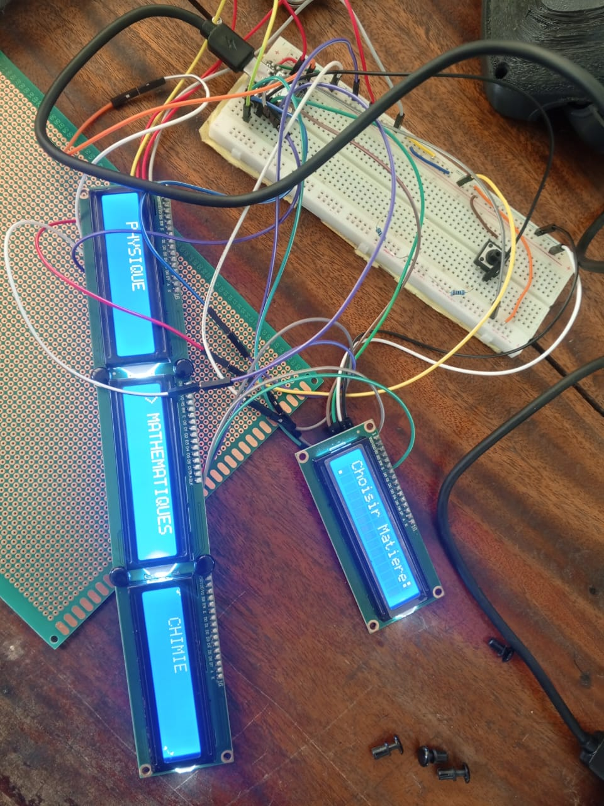

# Journal — mercredi 16 septembre 2026 (rédigé par : Kodjo KASSA)

## Fait aujourd'hui
**Projet de groupe**

- Tentative d'intégration d'un écran ILI TFT parallèle (Shield 2.4") comme interface d'affichage principale du robot.
- Migration vers une architecture à quatre écrans LCD 1602 via le protocole I2C.
- Raccordement des quatre bus logiciels (SoftI2C) sur la carte de développement et téléversement complet du code MicroPython de gestion du QCM (sélection des matières, affichage dynamique des questions et des options A/B/C).

# Appris

- Prise de conscience de la complexité des dépendances et de l'incompatibilité de certaines bibliothèques graphiques spécifiques aux écrans parallèles sous MicroPython.

# Raté, puis corrigé

- 

## Décidé

- Abandon du Text-To-Speech (TTS) et des fichiers audio pour concentrer l'interface utilisateur uniquement sur les 4 écrans LCD 1602 et les boutons poussoirs.

## À faire demain

- Rédiger et téléverser les fichiers texte de questions (ex: mathematiques.txt, physique.txt) structurés avec le séparateur ";" requis par le programme.
- Vérifier la disposition et l'emboîtement des quatre blocs d'affichage dans la fenêtre découpée du châssis pyramida du robot.